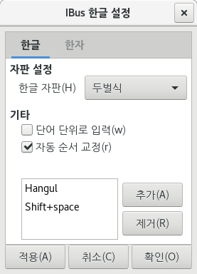

# CentOS 7 DVD


[TOC]


## Partion & Setting

### Partioning

> RedHat 권고 파티션 설정을 보고 해도 상관 없음.

1. /boot

   500M(장치유형 : 표준 파티션, 파일시스템 : ext4)

2. swap

   16G(해당 PC는 16G Ram 장착, 장치유형 : 표준 파티션, 파일시스템 : swap)

3. /home

   100G(라이브리러등 이것저것 설치하다 보면 귀찮아서 걍 100G, 장치유형 : LVM, 파일시스템 : ext4)

4. /

   나머지 용량 전부 때려 박는다(장치유형 : LVM, 파일시스템 : ext4)


### Setting


<출처 : http://img1.daumcdn.net/thumb/R1920x0/?fname=http%3A%2F%2Fcfile7.uf.tistory.com%2Fimage%2F2437A64F58A55A5622FAD7>


### Network setting

> Centos는 ubuntu 와는 다르게 네트워크 초기 설정을 직접 해줘야 한다. 하지만 본인은 특정 ip를 수동으로 잡아줬다.

IPv4 : 192.168.xxx.xxx

Netmask : 255.255.255.0

Gatway : 192.168.xxx.xxx

DNS : 8.8.8.8


## After installation

> 운영체제가 설치되고 나서 설정 해줄것들

```bash
$ yum update -y
$ systemctl stop firewalld
$ systemctl mask firewalld
$ yum install -y iptables-services
$ systemctl enable iptables
$ systemctl start iptables
$ iptables -nL
$ vi /etc/sysconfig/iptables
```


### Hangul setting

> 우분투에 비해 상당히 깔끔하고 편하다. 설정 -> 지역 및 언어 에서 다음과 같이 설정.
>
> 단축키 토글에 한글키를 그냥 냅둬도 상관 없음.





### Typora

> [Typora Github](https://github.com/RPM-Outpost/typora) 참고

```bash
$ git clone https://github.com/RPM-Outpost/typora
$ cd typora
$ ./create-package.sh x64

# alias 설정
$ vi ~/.bashrc
alias typora="/opt/typora/Typora"
```

위에꺼 안됨 바이너리 파일 받아서 실행해야됨

```shell
//not sudo
$ cd ~
$ wget https://typora.io/linux/Typora-linux-x64.tar.gz
$ ls
Typora-linux-x64.tar.gz
$ tar -xzvf Typora-linux-x64.tar.gz
$ ls
Typora-linux-x64
$ sudo mv Typora-linux-x64 /opt/typora
$ vi ~/.bashrc
alias typora="/opt/typora/Typora"

```

터미널에서 실행하면 꺼지지 안음 ㅋㅋㅋ

그래서 앱을 따로 등록해 줘야함

```shell
$ vi /home/codex/.local/share/applications/typora.desktop
[Desktop Entry]
Version=1.0
Type=Application
Name=Typora
Icon=/opt/typora/resources/app/asserts/icon/icon_512x512.png
Exec=/opt/typora/Typora
Comment=Minimal markdown md editor
Categories=Office;TextEditor
Terminal=false
MimeType=text/markdown
```


### Turn off Mouse accelation

```bash
# device list확인
$ xinput --list
# 현재 속도 확인
$ xset q | grep -A 1 Pointer
# 가속 끄기
$ xset m 0/1 4
$ sudo vi /usr/share/X11/xorg.conf.d/80-no-mouse-accel.conf
Section "InputClass"
    Identifier "Set mouse acceleration to zero"
    MatchIsPointer "on"
    MatchDevicePath "/dev/input/event*"

    # Default value of mouse acceleration: 2/1 4
    # Set AccelerationNumerator to zero to disable
    Option "AccelerationNumerator" "0"
    Option "AccelerationDenominator" "1"
    Option "AccelerationThreshold" "4"
EndSection
```


### Gnome themes

> https://github.com/vinceliuice/Mojave-gtk-theme

```bash
$ ./install.sh -c dark
```


### Shared Drive Auto mount

```bash
$ df -l
Filesystem               1K-blocks    Used  Available Use% Mounted on
...
/dev/sdb1               1831250824      12 1733558752   1% /run/media/codex/share

$ ll disk/by-uuid/
...
lrwxrwxrwx 1 root root 10 12월 26 12:56 7dbc16eb-699b-d401-30ac-16eb699bd401 -> ../../sdb1
...

$ sudo vi /etc/fstab
UUID=7dbc16eb-699b-d401-30ac-16eb699bd401 /run/media/codex/share ext4 defaults 0 0
```


## Dev Setting


### Python

> 기본으로 설치되어 있는 2.7.5버전 사용 하면 됨.


### Java

```bash
$ rpm -qa | grep jdk
java-1.7.0-openjdk-1.7.0.201-2.6.16.1.el7_6.x86_64
java-1.8.0-openjdk-headless-1.8.0.191.b12-1.el7_6.x86_64
java-1.8.0-openjdk-1.8.0.191.b12-1.el7_6.x86_64
java-1.7.0-openjdk-headless-1.7.0.201-2.6.16.1.el7_6.x86_64
copy-jdk-configs-3.3-10.el7_5.noarch
# jdk 는 설치되어 있으나 java compiler는 없는 상태
$ javac -verions
bash: javac: 명령을 찾을 수 없습니다...
$ yum list java*jdk-devel
java-1.6.0-openjdk-devel.x86_64        1:1.6.0.41-1.13.13.1.el7_3        base   
java-1.7.0-openjdk-devel.x86_64        1:1.7.0.201-2.6.16.1.el7_6        updates
java-1.8.0-openjdk-devel.i686          1:1.8.0.191.b12-1.el7_6           updates
java-1.8.0-openjdk-devel.x86_64        1:1.8.0.191.b12-1.el7_6           updates
java-11-openjdk-devel.i686             1:11.0.1.13-3.el7_6               updates
java-11-openjdk-devel.x86_64           1:11.0.1.13-3.el7_6               updates
$ sudo yum install -y java-1.8.0-openjdk-devel.x86_64
$ javac -version
javac 1.8.0_191
```


### IntelliJ


> [공홈](https://www.jetbrains.com/idea/download/#section=linux) 에서 linux용 다운로드
>
> 학생용 email 주소가 있으면 free
>
> 다만, linux에서는 앱들을 별다른 설치 없이 압축 해제된 폴더 자체에서 실행 가능한 경우가 많기에
>
> 필자는 /dev 폴더를 따로 만들어서 옮겨 주었다.

```bash
$ tar -xzf ideaIU-2018.3.2.tar.gz
$ cd idea-IU-183.4886.37/bin
$ ./idea.sh
```


#### Install & Setting


#### 공유 메모리 및 힙 늘리는법

> 이전에 IntelliJ 사용중에 CPU를 과도하게 점유하는 사태가 생김 IntelliJ가 점유 하는것이 아닌 kworker라는 process가 전부 점유.
>
> 원인은 Shared memory 의 용량 부족이고, 설정을 바꾸어 용량을 늘려주면됨.

```bash
$ cd IntelliJ가 설치되어 있는 위치/bin
$ ls
appletviewer.policy  idea.png         idea64.vmoptions        log.xml
format.sh            idea.properties  inspect.sh              printenv.py
fsnotifier           idea.sh          libdbm64.so             restart.py
fsnotifier-arm       idea.svg         libyjpagent-linux.so
fsnotifier64         idea.vmoptions   libyjpagent-linux64.so
# 이중에서 idea.vmoptions의 내용을 수정해 줘야 한다.
$ vi idea.vmoptions
...
-Xms1024m
-Xmx1024m
...
# 1024로 수정


```

#### google code style guid

<https://github.com/google/styleguide>

https://jiyeonseo.github.io/2016/11/15/setting-java-google-style-to-intellij/


## Kernel update


https://www.howtoforge.com/tutorial/how-to-upgrade-kernel-in-centos-7-server/


```shell
$ yum --enablerepo=elrepo-kernel install kernel-ml -y
# devel 이 yum 으로 설치가 안됨
# 때문에 오레곤 행님 들이 제공하는 repo에서 다운받음.
$ rpm -ivh http://ftp.osuosl.org/pub/elrepo/kernel/el7/x86_64/RPMS/kernel-ml-devel-4.20.1-1.el7.elrepo.x86_64.rpm
$ rpm -ivh http://ftp.osuosl.org/pub/elrepo/kernel/el7/x86_64/RPMS/kernel-ml-headers-4.20.1-1.el7.elrepo.x86_64.rpm


```


## 그래픽 카드 업데이트(정석)

> 우선 커널을 업데이트후 진행해줬다. 현재 커널 버전 **4.20.1-1.el7.elrepo.x86_64**.


### Download Nvidia graphic driver

> 현재 그래픽 카드에 맞는 Nvidia driver를 받아야 한다 필자는 GeForce GTX 1060 3GB 사용중.
>
> [Nvidia driver list](https://www.nvidia.com/object/unix.html) 에 들어가서 그래픽카드에 맞는 드라이버를 다운 받기를 바란다.

```shell
# 해당 자료는 설치 완료후에 수집된 자료임.
$ lshw -numeric -C display
  *-display                 
       description: VGA compatible controller
       product: GP106 [GeForce GTX 1060 3GB] [10DE:1C02]
       vendor: NVIDIA Corporation [10DE]
       physical id: 0
       bus info: pci@0000:01:00.0
       version: a1
       width: 64 bits
       clock: 33MHz
       capabilities: pm msi pciexpress vga_controller bus_master cap_list rom
       configuration: driver=nvidia latency=0
       resources: irq:132 memory:f6000000-f6ffffff memory:e0000000-efffffff memory:f0000000-f1ffffff ioport:e000(size=128) memory:c0000-dffff
```

> 이제 설치를 시작해 보자 처음 그래픽 카드에 대한 정보를 찾아보면

```shell
$ lshw -numeric -C display
  *-display                 
       description: VGA compatible controller
       product: GP106 [GeForce GTX 1060 3GB] [10DE:1C02]
       vendor: NVIDIA Corporation [10DE]
       physical id: 0
       bus info: pci@0000:01:00.0
       version: a1
       width: 64 bits
       clock: 33MHz
       capabilities: pm msi pciexpress vga_controller bus_master cap_list rom
	   configuration: driver=nouveau latency=0
	   ...
	   
# 이런식으로 configuration: driver의 셋팅이 nouveau로 잡혀있다 이걸 먼저 수정해줘야함.
$ vim /etc/default/grub
GRUB_CMDLINE_LINUX="crashkernel=auto rd.lvm.lv=centos/root rhgb quiet nouveau.modeset=0"

$ grub2-mkconfig -o /boot/grub2/grub.cfg
# 이제 드라이버 다운로드
# 필자는 Latest Long Lived Branch Version을 받았다.
$ wget http://us.download.nvidia.com/XFree86/Linux-x86_64/410.93/NVIDIA-Linux-x86_64-410.93.run

$ yum groupinstall "Development Tools" -y
$ yum install kernel-devel epel-release
$ yum install dkms
# 자 이제 여기서 중요한 부분이 커널을 업데이트 하면서 문제가 발생했다.
# yum 으로 커널을 업데이트 했고 kernel-devel 을 다운 받았지만, 업데이트된 커널의 devel은 설치가 되지 안았다. 해당 부분은 issue1을 살펴보자.
```

[Issue 1(kernel-devel 이 repo를 통해서 제대로 설치가 되지 않음)](#Issue 1(kernel-devel 이 repo를 통해서 제대로 설치가 되지 않음))

```shell
# 이제 x-org server를 끄자. 해당 명령어를 실행하면 화면이 꺼진다.
# 얼탱이가 없는게그럼 일반 유저들은 어케 설치하라는건지
$ systemctl isolate multi-user.target
# 이제 아까 받았던 nvidia driver를 설치하자.
$ ./NVIDIA-Linux-x86_64-410.93.run --kernel-source-path /usr/src/kernels/4.20.1-1.el7.elrepo.x86_64
# $ bash 다운받은 드라이버 이름 --kernel-source-path /usr/src/kernels/커널버전

```


> 이제 부터가 중요하다 다양한 블로그를 참조하였지만 전부 노답. 설치를 하다보면 대부분 yes를 해주면 된다. 하지만 단 한부분에서 yes를 하면 안되는데 바로 32bit library 를 설치 할건지에 대한 여부다.
>
> 절대 yes 하면 안된다. 필자의 pc도 64bit이고 대부분 pc들은 64bit 기반 cpu일것이다.
>
> 고로 No 를 해주자


> 이제 마무리 이고 reboot 만 해주면됨.


#### Issue 1(kernel-devel 이 repo를 통해서 제대로 설치가 되지 않음)

```shell
$ ./파일이름 --kernel-source-path /usr/src/kernels/4.20.1-1.el7.elrepo.x86_64

Failed to run `/usr/sbin/dkms build -m nvidia 
         -v 410.93 -k 4.20.1-1.el7.elrepo.x86_64`:     
         Error! echo                                   
         Your kernel headers for kernel                
         4.20.1-1.el7.elrepo.x86_64 cannot be found at 
         /lib/modules/4.20.1-1.el7.elrepo.x86_64/build 
         or                                            
         /lib/modules/4.20.1-1.el7.elrepo.x86_64/sourc 
         e.   
```


#### Sol

```shell
# 직접 /lib/modules/4.20.1-1.el7.elrepo.x86_64에 들어가서 확인해 보니 build와 source에 링크가 걸려있다.
# 먼저 /usr/src/kernels로 가보니 우리가 현재 적용한 4.20.1-1.el7.elrepo.x86_64가 없는것을 확인

# 착하게도 oregon repo에서 devel 과 header를 제공해준다.
$ rpm -ivh http://ftp.osuosl.org/pub/elrepo/kernel/el7/x86_64/RPMS/kernel-ml-devel-4.20.1-1.el7.elrepo.x86_64.rpm
$ rpm -ivh http://ftp.osuosl.org/pub/elrepo/kernel/el7/x86_64/RPMS/kernel-ml-headers-4.20.1-1.el7.elrepo.x86_64.rpm

$ ls /usr/src/kernels/
3.10.0-957.1.3.el7.x86_64  3.10.0-957.1.3.el7.x86_64.debug  4.20.1-1.el7.elrepo.x86_64


```


너무나도 착한 오레곤 대학교 행님들한테 감사를...[Oregon Repo](http://ftp.osuosl.org/pub/elrepo/kernel/el7/x86_64/RPMS/)


```shell
nvidia-installer was forced to guess the X library path '/usr/lib64' and X module path           
           '/usr/lib64/xorg/modules'; these paths were not queryable from the system.  If X fails to find   
           the NVIDIA X driver module, please install the `pkg-config` utility and the X.Org                
           SDK/development package for your distribution and reinstall the driver
```


yes


#### Issue 2 (libX11 없는 문제)

```shell
$ nvidia-setting
nvidia-settings: error while loading shared libraries: libX11.so.6: cannot open shared object file: No such file or directory
# 또 에러를 토해낸다. libX11.so.6가 없다는데 검색 ㄲ


$ yum whatprovides */libX11.so.6
libX11-1.6.5-2.el7.i686 : Core X11 protocol client library
Repo        : base
Matched from:
Filename    : /usr/lib/libX11.so.6


libX11-1.6.5-2.el7.x86_64 : Core X11 protocol client library
Repo        : base
Matched from:
Filename    : /usr/lib64/libX11.so.6


nxagent-3.5.99.17-1.el7.x86_64 : NX Agent
Repo        : epel
Matched from:
Filename    : /usr/lib64/nx/X11/libX11.so.6


```

[해결방법](https://interp.blog/binary-%EC%8B%A4%ED%96%89-%EC%8B%9C-%ED%95%84%EC%9A%94%ED%95%9C-%EB%9D%BC%EC%9D%B4%EB%B8%8C%EB%9F%AC%EB%A6%AC-%EC%84%A4%EC%B9%98/)


```shell
nvidia-settings 

ERROR: libgtk-3.so.0: cannot open shared object file: No such file or directory
       libnvidia-gtk3.so: cannot open shared object file: No such file or directory
       libgtk-x11-2.0.so.0: cannot open shared object file: No such file or directory
       libnvidia-gtk2.so: cannot open shared object file: No such file or directory


ERROR: A problem occured when loading the GUI library. Please check your installation and library path. You
       may need to specify this library when calling nvidia-settings. Please run `nvidia-settings --help` for
       usage information.


```


### Sol

> 결국 해결했다. 하나하나 자세히 살펴보자. 우선 libX11.so.6가 없다는 문제는 설치시에 32bit 라이브러리를 설치해서 그랬다. 때문에 드라이버를 uninstall 해준후. 재설치시에 32bit 라이브러리설치에 대해 no 를 했다. 그리고 오류 kernel-devel 이 제대로 설치되지 안아 오레곤 repo에서 설치해주었다.


## Gnome 설치

[Gnome 설치](https://linuxconfig.org/how-to-install-gui-gnome-on-centos-7-linux-system)

```shell
$ yum group list
$ yum groupinstall 'GNOME Desktop' -y
$ systemctl enable graphical.target --force
$ rm '/etc/systemd/system/default.target'
$ ln -s '/usr/lib/systemd/system/graphical.target' '/etc/systemd/system/default.target'
$ reboot
```


## Chrome

```shell
$ vi /etc/yum.repos.d/google-chrome.repo
[google-chrome]
name=google-chrome
baseurl=http://dl.google.com/linux/chrome/rpm/stable/$basearch
enabled=1
gpgcheck=1
gpgkey=https://dl-ssl.google.com/linux/linux_signing_key.pub
$ yum install google-chrome-stable -y 
$ google-chrome --version
Google Chrome 71.0.3578.98
```


## 한글 설정


```shell
$ localectl status
   System Locale: LANG=ko_KR.UTF-8
       VC Keymap: kr
      X11 Layout: n/a
# 따로 설정할 필요없는듯      
```


## Gnome tweek tool

```shell
yum install gnome-tweak-tool
```


## Theme

centos 테마 적용

### arc theme install

```shell
$ git clone https://github.com/horst3180/arc-theme --depth 1
$ cd arc-theme
$ ./autogen.sh --prefix=/usr
$ make install
# 혹시 install 시에 gtk3-devel 오류가 난다면 설치해줘야함.
$ yum install gtk3-devel
```


### Mac OS theme

```shell
$ git clone https://github.com/paullinuxthemer/Mc-OS-themes
$ cd Mc-OS-themes
$ cp -r McOS-MJV-Dark-mode-Gnome-3.30 /usr/share/themes/
# Mac Shell
$ cp -r McOS-Shell-themes/McOS-Dark-Shell/gnome-shell /usr/share/themes/McOS-MJV-Dark-mode-Gnome-3.30/
```

이제 기능 개선에서 해당 테마 적용하면됨.

맥 처럼 버튼의 위치를 조정하려면

```shell
$ gsettings set org.gnome.desktop.wm.preferences button-layout "close,minimize,maximize:"
```


## Hot corner disable

화면 가장자리에 마우스가 위치되면 화면이 작아지는것 비활성화

gnome extention에서 **No Topleft Hot Corner** 검색후 설치


## Gnome extention install

[정리 잘되있는 자료 참고 했음](https://www.owlib.com/blog?blog_id=5)

```shell
$ sudo yum remove gnome-shell-browser-plugin
$ sudo yum install git cmake coreutils jq
$ git clone https://github.com/GNOME/chrome-gnome-shell.git
$ cd chrome-gnome-shell
$ mkdir build
$ cd build
$ cmake -DCMAKE_INSTALL_PREFIX=/usr -DBUILD_EXTENSION=OFF ../
$ sudo make install
```


## Postman install


https://d2fault.github.io/2018/08/03/20180803-install-postman-centos/ 참고

```shell
# 다운로드
wget https://dl.pstmn.io/download/latest/linux64 -O postman.tar.gz
# 압축 해제
sudo tar -xzf postman.tar.gz -C /opt
# 링크 디렉토리 생성
sudo ln -s /opt/Postman/Postman /usr/bin/postman
```


```shell
cd /usr/share/applications
sudo vi postman.desktop
[Desktop Entry]
Encoding=UTF-8
Name=Postman
Exec=postman
Icon=/opt/Postman/app/resources/app/assets/icon.png
Terminal=false
Type=Application
Categories=Development
```


## Issue


### Grub은 나오나 부팅은 안되는 문제

> 확인해 보니 selinux 설정이 enforcing로 되어 있었다.
>
> 때문에 부팅 usb로 부팅하고 recumode 를 통해서 복구해야댐

```shell
# rescu 모드 진입후
# sh-4.1 chroot /mnt/sysimage
# bash~~
# 이제 배쉬로 진입 했으니 selinux 설정을 바꿔 줘야함.

$ vi /etc/sysconfig/selinux
SELINUX=disabled

reboot gogogogogogogo
```

> 또 한가지 문제가 fstab에 마운트 되도록 작성했을때 생기는 문제이다.
>
> 이유는 잘 모르겠으나 다른 방법으로 마운트 하자


```shell
$ vi /etc/rc.d/rc.local
mount -t ext4 /dev/sdb1 /media/share
# 확인해 보고 싶으면 마운트 되지 않은 상태로
$ source /etc/rc.d/rc.local
# 이렇게 마운트 되면댐
$ df -l
/dev/sdb1               1831250824 15265864 1718292900   1% /media/share
```


## ZSH

[해당 블로그 기준으로 작성함](<https://jdhao.github.io/2018/10/13/centos_zsh_install_use/>), [스택 오버 플로우 마지막 내용도 참고](<https://stackoverflow.com/questions/31624649/how-can-i-get-a-secure-system-wide-oh-my-zsh-configuration>)

```shell
$ su
$ wget -O zsh.tar.xz https://sourceforge.net/projects/zsh/files/latest/download
$ tar xf zsh.tar.xz
$ cd zsh
$ ./configure --prefix="$HOME/local" \
    CPPFLAGS="-I$HOME/local/include" \
    LDFLAGS="-L$HOME/local/lib"
$ make -j && make install
$ vim /etc/profile
export PATH=$HOME/local/bin:$PATH
export SHELL=`which zsh`
[ -f "$SHELL" ] && exec "$SHELL" -l
$ source /etc/profile
# zsh 쉘로 실행됨
zsh > sudo git clone https://github.com/robbyrussell/oh-my-zsh.git /etc/oh-my-zsh
zsh > vim /etc/oh-my-zsh/oh-my-zsh.sh
ZSH_CACHE_DIR="$ZSH/cache"
if [[ -z "$ZSH_CACHE_DIR" ]]; then
  ZSH_CACHE_DIR="$ZSH/cache"
fi
zsh > exit
$ cat /etc/shell
# /usr/local/bin/zsh 삭제
/bin/zsh
$ cp /root/local/bin/zsh /bin/zsh
$ chsh -s /bin/zsh root
$ reboot
```

이쯤오면 일반계정은 적용 안됨

권한 줄꺼임

```shell
$ sudo vim /etc/group
# 루트 계정뒤에 루트 그룹에 추가할 계정 추가
root:x:0:codex
$ reboot
```

### font 설정

```shell
$ git clone https://github.com/powerline/fonts.git
$ cd fonts
$ ./install.sh
# clean-up a bit
$ cd ..
$ cp -r ./fonts/UbuntuMono /usr/share/fonts/
$ rm -rf fonts
$ fc-cache -f -v
$ fc-list | grep Ubuntu
# 폰트 리로드
$ fc-cache -r
```

### 현재 디렉토리 새탭

워킹디렉토리에서 새탭을 열었을때 디렉토리가 유지되게 하는것.

다음 내용을 일반 유저와 루트 모두에추가

```shell
$ vim ~/.zshrc
[[ -f /etc/profile.d/vte.sh ]] && . /etc/profile.d/vte.sh
$ source ~/.zshrc
$ sudo echo "[[ -f /etc/profile.d/vte.sh ]] && . /etc/profile.d/vte.sh" >> /root/.zshrc
$ sudo source /root/.zshrc
```


## Kernel

### Elrep 최신 커널 설치

```shell
$ rpm --import https://www.elrepo.org/RPM-GPG-KEY-elrepo.org
$ rpm -Uvh http://www.elrepo.org/elrepo-release-7.0-2.el7.elrepo.noarch.rpm
$ yum --disablerepo="*" --enablerepo="elrepo-kernel" list available
$ yum --enablerepo=elrepo-kernel install kernel-ml
```

## KVM

### virbr0 사라졌을때 생성

[virbr0 생성](https://sugerent.tistory.com/366)

```shell
$ virsh net-list –all
$ virsh net-define /usr/share/libvirt/networks/default.xml
$ virsh net-autostart default
$ virsh net-start default
$ ifconfig
virbr0: flags=4099<UP,BROADCAST,MULTICAST>  mtu 1500
        inet 192.168.122.1  netmask 255.255.255.0  broadcast 192.168.122.255
        ether 52:54:00:43:1d:de  txqueuelen 1000  (Ethernet)
        RX packets 0  bytes 0 (0.0 B)
        RX errors 0  dropped 0  overruns 0  frame 0
        TX packets 0  bytes 0 (0.0 B)
        TX errors 0  dropped 0 overruns 0  carrier 0  collisions 0
```


## GoldenDict install

```shell
$ yum install goldendict
# 다음 사전 추가 링크
http://engdic.daum.net/dicen/small_search.do?endic_kind=all&m=all&nil_profile=vsearch&nil_src=engdic&q=%GDWORD%
```


## Slack

```shell
$ wget 
```


## Ruby Install

yum 을 통해서 ruby를 설치하게 되면 구버전의 ruby가 설치됨.

2.0.0 버전의 ruby임.

때문에 rvm을 통해서 설치해야함.


```shell
$ yum remove ruby
$ yum install gcc-c++ patch readline readline-devel zlib zlib-devel libffi-devel \\n openssl-devel make bzip2 autoconf automake libtool bison sqlite-devel
$ source /etc/profile.d/rvm.sh
$ rvm reload
$ rvm requirements run
$ rvm list known
# MRI Rubies
[ruby-]1.8.6[-p420]
[ruby-]1.8.7[-head] # security released on head
[ruby-]1.9.1[-p431]
[ruby-]1.9.2[-p330]
[ruby-]1.9.3[-p551]
[ruby-]2.0.0[-p648]
[ruby-]2.1[.10]
[ruby-]2.2[.10]
[ruby-]2.3[.8]
[ruby-]2.4[.6]
[ruby-]2.5[.5]
[ruby-]2.6[.3]
[ruby-]2.7[.0-preview1]
ruby-head
...


$ rvm install 2.7
* NOTICE                                                                                                 *
**********************************************************************************************************
* RVM has encountered a new or modified after_install_auto_gem file in the current directory,            *
* environment variables from this file will be exported and therefore may influence your shell.          *
*                                                                                                        *
* Examine the contents of this file carefully to be sure the contents are safe before trusting it!       *
* Do you wish to trust '/home/codex/.rvm/hooks/after_install_auto_gem'?                                  *
* Choose v[iew] below to view the contents                                                               *
**********************************************************************************************************
y[es], n[o], v[iew], c[ancel]> y
**********************************************************************************************************
* NOTICE                                                                                                 *
**********************************************************************************************************
* RVM has encountered a new or modified after_use_maglev file in the current directory, environment      *
* variables from this file will be exported and therefore may influence your shell.                      *
*                                                                                                        *
* Examine the contents of this file carefully to be sure the contents are safe before trusting it!       *
* Do you wish to trust '/home/codex/.rvm/hooks/after_use_maglev'?                                        *
* Choose v[iew] below to view the contents                                                               *
**********************************************************************************************************
y[es], n[o], v[iew], c[ancel]> y

# Setup Default Ruby
$ rvm list 
* ruby-2.3.3 [ x86_64 ]
=> ruby-2.7.0 [ x86_64 ]

# => - current
# =* - current && default
#  * - default

$ rvm use 2.7 --default
Using /usr/local/rvm/gems/ruby-2.7.0
$ ruby --version
ruby 2.7.0p0 (2019-12-25 revision 647ee6f091) [x86_64-linux]
```


### rvm 버전 관련 경고 뜰때

```shell
# rvm 사용시 다음과 같은 경고가 뜰때는 stable 버전으로 업데이트 해주면 된다.
Warning, new version of rvm available '1.29.10', you are using older version '1.29.9'.
You can disable this warning with:   echo rvm_autoupdate_flag=0 >> ~/.rvmrc
You can enable auto-update with:     echo rvm_autoupdate_flag=2 >> ~/.rvmrc
You can update manually with:        rvm get VERSION                         (e.g. 'rvm get stable')
$ rvm get stable
```

### Jeklly Install


```shell
$ gem install jeklly # ruby >= 2.3
```

